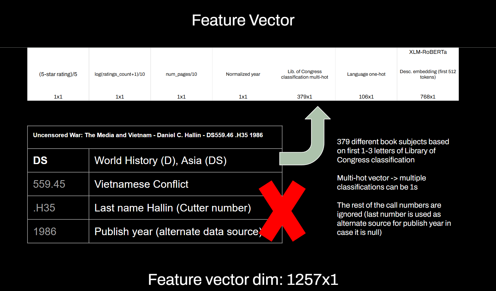

# LitShare (2025-2026 Capstone Project)

LitShare is an upcoming book discovery platform powered by a Bayesian recommendation model which leverages both book description embeddings (currently 512-dim vectors obtained from book synopses using RoBERTa-XLM) as well as collaborative signals to deliver timely and relevant recommendations for each LitShare user.

Mustafa Abdulameer is largely responsible for the ML component of the project, including design of model architecture, training, and evaluation. The model is trained with a 64-dim latent vector (both users and books are feature projected into a latent space). The ensemble model uses Bayesian Model Averaging - predictions from the submodels (currently ten) are weighted by posterior probability in order to provide more robust results.

Book Feature Vector:

Here is a video demonstration of the "infinite scroll" explore page which is connected to the model.

